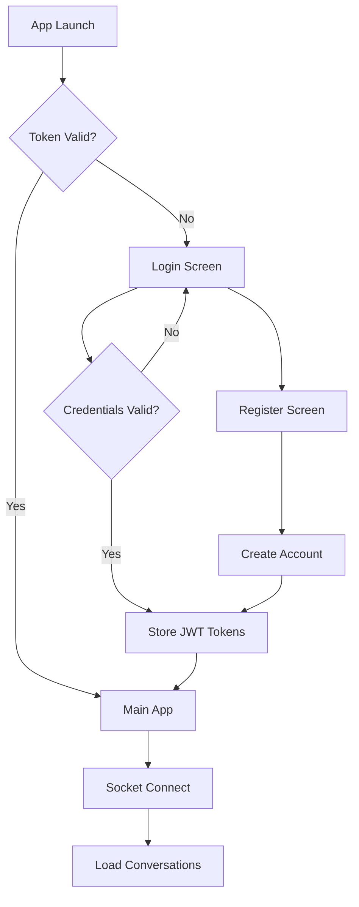
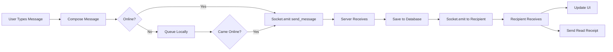
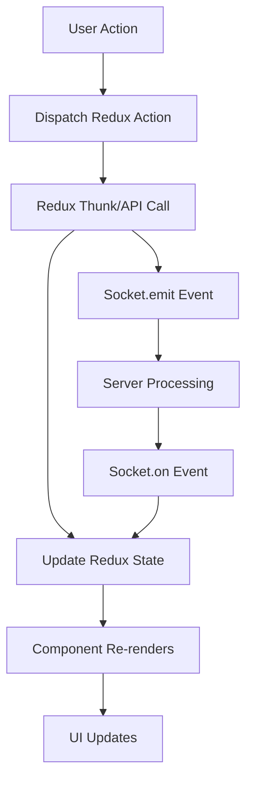

# 📱 WhatsApp Clone - Frontend (React Native)

<div align="center">


A modern, feature-rich WhatsApp clone mobile application built with **React Native**, **Expo SDK 54**, and **TypeScript**.

[Features](#-features) • [Architecture](#-architecture) • [Installation](#-installation) • [Usage](#-usage) • [Screens](#-screens)

</div>

---

## 🌟 Features

### 💬 Core Messaging
- **Real-time Chat** - Instant message delivery via Socket.IO
- **Group Chats** - Create and manage group conversations with up to 256 members
- **Message Types** - Text, images, videos, audio, documents, voice notes
- **Link Previews** - Automatic rich preview generation for URLs
- **Message Reactions** - React to messages with emojis (👍❤️😂😮😢🙏)
- **Message Forwarding** - Forward messages to multiple chats
- **Reply & Quote** - Reply to specific messages with context
- **Starred Messages** - Save important messages for quick access
- **Search Messages** - Search within conversations and across all chats

### 📞 Voice & Video Calling
- **WebRTC Audio Calls** - Crystal-clear 1:1 audio calling with call waiting
- **WebRTC Video Calls** - HD video calling with camera/mic controls
- **Call History** - Complete log of all incoming, outgoing, and missed calls
- **Call Notifications** - Push notifications for incoming calls

### 👤 User Experience
- **Modern UI/UX** - Beautiful, card-based design with Platform-specific shadows
- **Dark Mode** - Complete theme system (Light/Dark/Auto)
- **Typing Indicators** - See when others are typing in real-time
- **Read Receipts** - Delivered (✓✓) and Read (✓✓ blue) status
- **Online Status** - Real-time presence system with "last seen"
- **Profile Management** - Customizable profile with avatar, about, status
- **Chat Wallpapers** - Personalize chat backgrounds
- **Custom Notifications** - Per-chat notification settings
- **Font Size Options** - Accessibility-friendly text sizing

### 📊 Advanced Features
- **Offline Support** - Local caching and message queuing
- **Archive Chats** - Hide chats without deleting them
- **Pin Conversations** - Keep important chats at the top (up to 3)
- **Mute Chats** - Silence notifications for 8 hours, 1 week, or always
- **Broadcast Lists** - Send messages to multiple contacts at once
- **Labels & Organization** - Categorize chats with custom labels
- **Disappearing Messages** - Auto-delete messages after 24h/7d/90d
- **Export Chat** - Export chat history as text file
- **Storage Management** - Clear cache, manage media storage

### 🔒 Security & Privacy
- **JWT Authentication** - Secure login with access & refresh tokens
- **Two-Step Verification** - Additional PIN security
- **Blocked Contacts** - Block unwanted users
- **Privacy Settings** - Control who sees your profile, status, last seen
- **Message Timer** - Self-destructing messages

---

## 🏗️ Architecture

### **Tech Stack**

| Technology | Purpose | Version |
|-----------|---------|---------|
| **React Native** | Mobile framework | 0.76.5 |
| **Expo** | Development platform | SDK 54 |
| **TypeScript** | Type safety | 5.3.x |
| **Redux Toolkit** | State management | 2.x |
| **React Navigation** | Routing & navigation | 6.x |
| **Socket.IO Client** | Real-time communication | 4.x |
| **Axios** | HTTP requests | 1.x |
| **React Native Paper** | UI components | 5.x |
| **Expo SecureStore** | Secure token storage | Latest |
| **Expo AV** | Audio/Video playback | Latest |
| **Expo Image Picker** | Media selection | Latest |
| **date-fns** | Date formatting | 3.x |

### **Folder Structure**

```
expo-app/
├── App.tsx                      # Root component
├── index.ts                     # Entry point
├── app.json                     # Expo configuration
├── package.json                 # Dependencies
├── tsconfig.json                # TypeScript config
│
├── assets/                      # Static assets
│   ├── icon.png
│   ├── splash.png
│   └── adaptive-icon.png
│
└── src/
    ├── api/                     # API Layer
    │   ├── axios.ts            # Axios instance with interceptors
    │   └── endpoints/
    │       ├── auth.ts         # Authentication APIs
    │       ├── chat.ts         # Chat & messaging APIs
    │       └── user.ts         # User management APIs
    │
    ├── components/              # Reusable Components
    │   ├── MessageBubble.tsx   # Chat message bubble
    │   ├── MessageComposer.tsx # Message input with attachments
    │   ├── chat/               # Chat-specific components
    │   ├── call/               # Call-related components
    │   ├── media/              # Media viewers & pickers
    │   └── common/             # Shared UI components
    │
    ├── hooks/                   # Custom React Hooks
    │   ├── useWebRTC.ts        # WebRTC call management
    │   ├── useSocket.ts        # Socket.IO connection
    │   ├── useTyping.ts        # Typing indicator logic
    │   └── usePresence.ts      # User presence tracking
    │
    ├── navigation/              # Navigation Configuration
    │   ├── AppNavigator.tsx    # Root navigator
    │   ├── AuthNavigator.tsx   # Auth flow (Login/Register)
    │   └── MainNavigator.tsx   # Main app tabs & stacks
    │
    ├── screens/                 # Screen Components
    │   ├── auth/               # Authentication screens
    │   │   ├── LoginScreen.tsx
    │   │   └── RegisterScreen.tsx
    │   │
    │   ├── chats/              # Chat screens (36 screens)
    │   │   ├── ChatsListScreen.tsx        # Main chat list
    │   │   ├── ChatScreen.tsx             # Individual chat view
    │   │   ├── NewChatScreen.tsx          # Select contact
    │   │   ├── GroupInfoScreen.tsx        # Group details
    │   │   ├── NewGroupInfoScreen.tsx     # Create group
    │   │   ├── NewGroupParticipantsScreen.tsx
    │   │   ├── SearchMessagesScreen.tsx   # Search in chat
    │   │   ├── StarredMessagesScreen.tsx  # Saved messages
    │   │   ├── ArchivedChatsScreen.tsx    # Archived chats
    │   │   ├── BroadcastListScreen.tsx    # Broadcast messaging
    │   │   ├── MessageRequestsScreen.tsx  # Unknown contacts
    │   │   ├── MuteChatScreen.tsx         # Mute management
    │   │   ├── ForwardMessageScreen.tsx   # Forward to contacts
    │   │   ├── MediaLinksScreen.tsx       # Shared media
    │   │   ├── DisappearingMessagesScreen.tsx
    │   │   ├── ChatLabelsScreen.tsx       # Organize chats
    │   │   ├── ChatThemeScreen.tsx        # Customize theme
    │   │   ├── ChatWallpaperScreen.tsx    # Set wallpaper
    │   │   └── ... (20+ more screens)
    │   │
    │   ├── calls/              # Call screens
    │   │   ├── CallsListScreen.tsx        # Call history
    │   │   ├── CallScreen.tsx             # Active call UI
    │   │   └── IncomingCallScreen.tsx     # Incoming call modal
    │   │
    │   ├── contacts/           # Contact screens
    │   │   ├── ContactsListScreen.tsx
    │   │   ├── ContactProfileScreen.tsx
    │   │   └── SelectContactScreen.tsx
    │   │
    │   └── settings/           # Settings screens (25+ screens)
    │       ├── SettingsScreen.tsx
    │       ├── ProfileScreen.tsx
    │       ├── NotificationSettingsScreen.tsx
    │       ├── PrivacySettingsScreen.tsx
    │       ├── DataStorageScreen.tsx
    │       ├── ThemeSettingsScreen.tsx
    │       ├── FontSizeSettingsScreen.tsx
    │       ├── WallpaperSettingsScreen.tsx
    │       └── ... (18+ more screens)
    │
    ├── services/                # Business Logic Services
    │   ├── socketService.ts    # Socket.IO management
    │   ├── offlineService.ts   # Offline queue & sync
    │   ├── notificationService.ts  # Push notifications
    │   ├── storageService.ts   # Local storage wrapper
    │   └── webrtcService.ts    # WebRTC connection manager
    │
    ├── store/                   # Redux Store
    │   ├── index.ts            # Store configuration
    │   └── slices/
    │       ├── authSlice.ts    # Auth state & tokens
    │       ├── chatSlice.ts    # Conversations & messages
    │       ├── callSlice.ts    # Call state management
    │       └── settingsSlice.ts # User preferences
    │
    ├── theme/                   # Design System
    │   ├── colors.ts           # Color palette
    │   ├── typography.ts       # Font styles
    │   ├── spacing.ts          # Spacing constants
    │   └── shadows.ts          # Platform shadows
    │
    ├── types/                   # TypeScript Types
    │   ├── models.ts           # Data models (User, Message, etc.)
    │   ├── navigation.ts       # Navigation types
    │   └── api.ts              # API request/response types
    │
    └── utils/                   # Utilities
        ├── constants.ts        # App constants (colors, sizes)
        ├── helpers.ts          # Helper functions
        ├── validation.ts       # Form validation
        └── formatters.ts       # Date/time formatters
```

---

## 🎨 Design System

### **Color Palette**

```typescript
// Primary Colors
PRIMARY_GREEN: '#25D366'      // WhatsApp green (buttons, active states)
SECONDARY_TEAL: '#128C7E'     // Dark green (headers)
LIGHT_GREEN: '#DCF8C6'        // Sent message bubbles

// Backgrounds
BACKGROUND: '#F5F7FA'         // Screen background
CARD_WHITE: '#FFFFFF'         // Card/container background
INPUT_GRAY: '#F0F2F5'         // Input fields

// Text Colors
TEXT_PRIMARY: '#000000'       // Primary text
TEXT_SECONDARY: '#667781'     // Secondary text
TEXT_TERTIARY: '#8696A0'      // Metadata, timestamps

// Accent Colors
BLUE: '#2196F3'               // Links, info
ORANGE: '#FF9800'             // Archived, warnings
GOLD: '#FFA500'               // Starred messages
RED: '#F44336'                // Errors, delete actions
```

### **Typography**

```typescript
// Headers
HEADER_LARGE: { fontSize: 22, fontWeight: '700' }
HEADER_MEDIUM: { fontSize: 20, fontWeight: '600' }

// Body Text
TITLE: { fontSize: 16, fontWeight: '600' }
BODY: { fontSize: 14, fontWeight: '400' }
CAPTION: { fontSize: 13, color: '#667781' }
METADATA: { fontSize: 12, color: '#8696A0' }
```

### **Spacing**

```typescript
SECTION_PADDING: 20          // Horizontal section padding
CARD_PADDING: 16             // Internal card padding
HEADER_PADDING: 24           // Header padding
ITEM_GAP: 12                 // Gap between items
ICON_MARGIN: 16              // Icon spacing
```

### **Shadows (Platform-specific)**

```typescript
// iOS Shadow
shadowColor: '#000'
shadowOffset: { width: 0, height: 1-2 }
shadowOpacity: 0.1
shadowRadius: 4-8

// Android Shadow
elevation: 2-4
```

---

## 🔄 Application Flow

### **Authentication Flow**



### **Messaging Flow**



### **Call Flow (WebRTC)**

```mermaid
sequenceDiagram
    participant Caller
    participant Server
    participant Callee

    Caller->>Server: Socket.emit call:offer
    Server->>Callee: Socket.emit call:incoming
    Callee->>Server: Socket.emit call:accept
    Server->>Caller: Socket.emit call:accepted
    
    Caller->>Caller: Create RTCPeerConnection
    Caller->>Caller: Add local stream
    Caller->>Caller: Create offer
    Caller->>Server: Send SDP offer
    Server->>Callee: Forward SDP offer
    
    Callee->>Callee: Create RTCPeerConnection
    Callee->>Callee: Add local stream
    Callee->>Callee: Set remote description
    Callee->>Callee: Create answer
    Callee->>Server: Send SDP answer
    Server->>Caller: Forward SDP answer
    
    Caller->>Callee: ICE candidates
    Callee->>Caller: ICE candidates
    
    Note over Caller,Callee: WebRTC Direct Connection Established
    Caller<-->Callee: Audio/Video Stream
```

### **State Management Flow**



---

## 🚀 Installation

### **Prerequisites**

- **Node.js** 18+ and npm/yarn
- **Expo CLI**: `npm install -g expo-cli`
- **iOS Simulator** (Mac only) or **Android Emulator**
- **Backend server** running (see [server/README.md](../server/README.md))

### **Step 1: Clone & Install**

```bash
cd expo-app
npm install
```

### **Step 2: Configure Environment**

Create `.env` file (if not exists):

```env
EXPO_PUBLIC_API_URL=http://localhost:3000
EXPO_PUBLIC_SOCKET_URL=http://localhost:3000
```

> **For iOS Simulator**: Use `http://localhost:3000`  
> **For Android Emulator**: Use `http://10.0.2.2:3000`  
> **For Physical Device**: Use your computer's local IP (e.g., `http://192.168.1.100:3000`)

### **Step 3: Start Development Server**

```bash
npm start
# or
npx expo start
```

Press:
- `i` - Open iOS simulator
- `a` - Open Android emulator
- `w` - Open in web browser (limited features)

---

## 📱 Usage

### **Running on Physical Device**

1. Install **Expo Go** app on your phone
2. Scan the QR code from the terminal
3. Make sure your phone and computer are on the same network

### **Development Commands**

```bash
# Start with cache cleared
npm start -- --clear

# Start with tunnel (for remote testing)
npm start -- --tunnel

# Run tests (if configured)
npm test

# Type checking
npx tsc --noEmit

# Lint code
npm run lint
```

### **Building for Production**

```bash
# Install EAS CLI
npm install -g eas-cli

# Login to Expo
eas login

# Configure build
eas build:configure

# Build for iOS
eas build --platform ios

# Build for Android
eas build --platform android

# Build for both
eas build --platform all
```

---

## 📸 Screens Overview

### **Authentication (2 screens)**
- ✅ **LoginScreen** - Email/password login with JWT
- ✅ **RegisterScreen** - New user registration

### **Chats (36 screens)**

**Main Screens:**
- ✅ **ChatsListScreen** - All conversations with real-time updates
- ✅ **ChatScreen** - Individual/group chat with messages
- ✅ **NewChatScreen** - Select contact to start chat
- ✅ **SearchMessagesScreen** - Search within conversation

**Group Management:**
- ✅ **NewGroupParticipantsScreen** - Select group members
- ✅ **NewGroupInfoScreen** - Set group name and icon
- ✅ **GroupInfoScreen** - Group details, members, settings
- ✅ **ManageGroupAdminsScreen** - Promote/demote admins
- ✅ **GroupPermissionsScreen** - Control who can send messages
- ✅ **AddGroupMembersScreen** - Add new participants

**Organization:**
- ✅ **ArchivedChatsScreen** - Hidden conversations
- ✅ **StarredMessagesScreen** - Saved important messages
- ✅ **BroadcastListScreen** - Send to multiple contacts
- ✅ **MessageRequestsScreen** - Messages from unknown contacts
- ✅ **ChatLabelsScreen** - Categorize chats
- ✅ **PinChatScreen** - Manage pinned conversations

**Customization:**
- ✅ **ChatThemeScreen** - Choose chat theme
- ✅ **ChatWallpaperScreen** - Set chat background
- ✅ **ChatBackgroundScreen** - Wallpaper options
- ✅ **MuteChatScreen** - Notification settings
- ✅ **CustomNotificationScreen** - Per-chat notification sound

**Privacy & Settings:**
- ✅ **DisappearingMessagesScreen** - Auto-delete timer
- ✅ **MessageTimerScreen** - Set disappearing message duration
- ✅ **ClearChatScreen** - Delete chat history
- ✅ **ExportChatScreen** - Export chat as text
- ✅ **ReportGroupScreen** - Report abuse

**Media & Sharing:**
- ✅ **MediaLinksScreen** - Shared photos, videos, links, docs
- ✅ **ForwardMessageScreen** - Forward to contacts
- ✅ **LiveLocationScreen** - Share real-time location

**Other:**
- ✅ **SearchAllChatsScreen** - Global message search
- ✅ **GroupInviteLinkScreen** - Generate invite link
- ✅ **GroupDescriptionScreen** - Edit group description
- ✅ **GroupSettingsScreen** - Group admin settings
- ✅ **CreatePollScreen** - Create poll in group
- ✅ **ViewPollScreen** - View poll results

### **Calls (3 screens)**
- ✅ **CallsListScreen** - Call history with filters
- ✅ **CallScreen** - Active audio/video call UI
- ✅ **IncomingCallScreen** - Incoming call modal

### **Contacts (3 screens)**
- ✅ **ContactsListScreen** - All contacts
- ✅ **ContactProfileScreen** - Contact details
- ✅ **SelectContactScreen** - Multi-select for groups

### **Settings (25+ screens)**

**Main Settings:**
- ✅ **SettingsScreen** - Main settings hub
- ✅ **ProfileScreen** - Edit profile (name, about, photo)
- ✅ **AccountScreen** - Account management

**Privacy & Security:**
- ✅ **PrivacySettingsScreen** - Last seen, profile photo, about
- ✅ **SecuritySettingsScreen** - Security options
- ✅ **TwoStepVerificationScreen** - Setup 2FA PIN
- ✅ **BlockedContactsScreen** - Manage blocked users
- ✅ **ChangeNumberScreen** - Change phone number

**Notifications:**
- ✅ **NotificationSettingsScreen** - Notification preferences
- ✅ **NotificationSoundsScreen** - Custom sounds

**Chats:**
- ✅ **ChatSettingsScreen** - Default chat settings
- ✅ **ThemeSettingsScreen** - Light/Dark/Auto mode
- ✅ **WallpaperSettingsScreen** - Default wallpaper
- ✅ **FontSizeSettingsScreen** - Text size (Small/Medium/Large/Extra Large)
- ✅ **BackupSettingsScreen** - Chat backup

**Data & Storage:**
- ✅ **DataStorageScreen** - Storage usage
- ✅ **NetworkUsageScreen** - Data usage stats
- ✅ **StorageUsageScreen** - Manage storage
- ✅ **DataUsageScreen** - Network statistics

**Help & Support:**
- ✅ **HelpScreen** - Help center
- ✅ **AboutScreen** - App version, terms
- ✅ **ContactUsScreen** - Support contact

**Other:**
- ✅ **LanguageSettingsScreen** - App language
- ✅ **AppearanceSettingsScreen** - UI customization
- ✅ **AdvancedSettingsScreen** - Developer options

---

## 🔌 API Integration

### **Axios Configuration**

```typescript
// src/api/axios.ts
const api = axios.create({
  baseURL: process.env.EXPO_PUBLIC_API_URL,
  timeout: 30000,
});

// Request interceptor (add auth token)
api.interceptors.request.use((config) => {
  const token = getAccessToken();
  if (token) {
    config.headers.Authorization = `Bearer ${token}`;
  }
  return config;
});

// Response interceptor (handle 401, refresh token)
api.interceptors.response.use(
  (response) => response,
  async (error) => {
    if (error.response?.status === 401) {
      // Token expired, try refresh
      const newToken = await refreshAccessToken();
      error.config.headers.Authorization = `Bearer ${newToken}`;
      return api(error.config);
    }
    return Promise.reject(error);
  }
);
```

### **Socket.IO Integration**

```typescript
// src/services/socketService.ts
class SocketService {
  socket: Socket | null = null;

  connect(token: string) {
    this.socket = io(process.env.EXPO_PUBLIC_SOCKET_URL, {
      auth: { token },
      transports: ['websocket'],
    });

    this.socket.on('connect', () => {
      console.log('Socket connected');
    });

    this.socket.on('message:new', (message) => {
      store.dispatch(addMessage(message));
      showNotification(message);
    });

    this.socket.on('typing:update', (data) => {
      store.dispatch(setTyping(data));
    });
  }

  sendMessage(conversationId: string, content: string) {
    this.socket?.emit('send_message', { conversationId, content });
  }

  disconnect() {
    this.socket?.disconnect();
  }
}
```

---

## 🧪 Testing

```bash
# Run tests
npm test

# Watch mode
npm test -- --watch

# Coverage report
npm test -- --coverage
```

**Test Structure:**

```
src/
├── __tests__/
│   ├── components/
│   │   └── MessageBubble.test.tsx
│   ├── screens/
│   │   └── ChatScreen.test.tsx
│   └── services/
│       └── socketService.test.ts
```

---

## 🐛 Troubleshooting

### **Common Issues**

**1. Cannot connect to backend**
```bash
# Check backend is running
curl http://localhost:3000/health

# For Android emulator, use correct IP
EXPO_PUBLIC_API_URL=http://10.0.2.2:3000
```

**2. Socket connection fails**
- Ensure backend Socket.IO server is running
- Check firewall settings
- Verify JWT token is valid

**3. Images not loading**
- Check `EXPO_PUBLIC_API_URL` includes correct protocol
- Verify backend `STATIC_URL` is configured
- Check file upload permissions

**4. Build errors**
```bash
# Clear cache
npx expo start --clear

# Reinstall dependencies
rm -rf node_modules package-lock.json
npm install
```

---

## 📚 Additional Resources

- [Expo Documentation](https://docs.expo.dev/)
- [React Native Paper](https://callstack.github.io/react-native-paper/)
- [Redux Toolkit](https://redux-toolkit.js.org/)
- [React Navigation](https://reactnavigation.org/)
- [Socket.IO Client](https://socket.io/docs/v4/client-api/)

---

## 📄 License

MIT License - See [LICENSE](../LICENSE) for details

---

## 👨‍💻 Author

Built with ❤️ by **Suraj**

**Backend Documentation**: [../server/README.md](../server/README.md)
